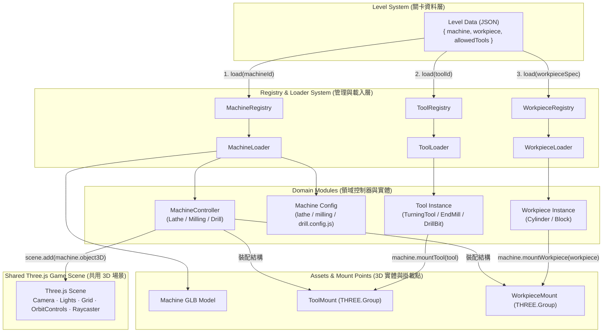
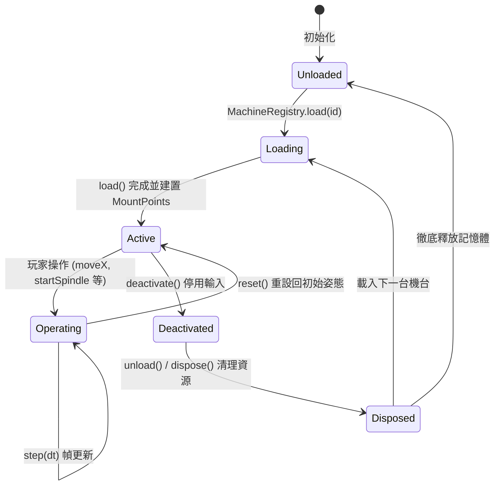

# Machine System v1.0 系統架構設計文件 (ARCHITECTURE)

本文件完整說明 **Machine System v1.0** 的軟體分層設計、模組調用關係、生命週期規範與統一 Three.js 場景的架構藍圖。

---

## 一、系統核心哲學 (Core Philosophy)

> **「不是為車床、銑床、鑽床分別建立三個網站，而是建立一個 Three.js 主網站，三大工具機都是可以被同一個 3D Scene 動態載入與卸載的 Machine Module。」**

### 角色責任劃分：
- **GLB** = 機器的 3D 身體（幾何與網格）。
- **Config** = 告訴程式模型內有哪些重要結構、Pivot、行程極限與 Mount Points。
- **Controller** = 操作機器的方法與運動合約。
- **Registry** = 負責找到、載入、快取與安全釋放資產的管理員。
- **Level** = 透過純資料描述（JSON）告訴玩家要完成什麼任務。
- **Scene** = 實際呈現 Machine + Tool + Workpiece 的共享三維世界。

---

## 二、全域架構流程圖 (System Architecture Flowchart)



---

## 三、網站全域導覽架構 (Website Sitemap)

```
Website (Single SPA)
├─ Home (首頁：3張工具機導航卡片)
├─ Safety (工安守則：工場 PPE 與專屬安全規範)
├─ Tool Introduction (刀具目錄：各切削刀具規格、適用機台與工序)
├─ Level Select (關卡規劃預覽：資料驅動的關卡 JSON 預覽)
└─ Game Workspace (加工教室：單一 Three.js Canvas 場景)
    ├─ Top Switcher (機台切換籤頁)
    ├─ Developer Panel (開發者測試面板)
    ├─ UI (ControlPanel, Telemetry DRO, PartTooltip)
    └─ Shared Three.js Scene
        ├─ Camera (動態根據機台半徑自動調整視角與阻尼)
        ├─ Lights & Shadows (主光源、環境光、半球光、地板網格)
        ├─ Machine Object3D (動態裝載目前機台)
        │    ├─ ToolMount ──► Tool 3D
        │    └─ WorkpieceMount ──► Workpiece 3D
        └─ Raycaster & Pointer Manager (單一事件委託，切換機台時乾淨重綁)
```

---

## 四、Machine Module 生命週期 (Machine Lifecycle)

工具機在切換與關卡更替時，具備嚴謹的五段生命週期：



### 生命週期階段詳細說明：

1. **`load()`**:
   - `MachineLoader` 讀取並檢驗 Config JSON 與 GLB 二進制結構。
   - 重建機械運動關節、Pivot 旋轉中心與父子層級。
   - 根據 Config 自動建立 `ToolMount` 與 `WorkpieceMount`。
   - 建立狀態初始記錄（`restTransforms`）。
2. **`activate()`**:
   - 啟動機台，允許接收使用者的手輪、滑桿、鍵盤與觸控事件。
3. **`reset()`**:
   - 還原所有軸向導軌位移量為 `0`。
   - 還原所有手輪旋轉角度為 `0`。
   - 還原變速箱檔位、主軸旋轉角度與進給手柄至原點。
   - 重設已掛載刀具與工件之局部變換矩陣。
4. **`deactivate()`**:
   - 立即切斷主軸運轉（`stopSpindle()`）。
   - 停用所有指標與手輪輸入，釋放 Pointer Capture。
5. **`dispose()` / `unload()`**:
   - 執行 `unmountTool()` 與 `unmountWorkpiece()` 並釋放幾何體/材質。
   - 卸載所有動態替換之 MeshStandardMaterial 與複製材質。
   - 移除所有 Raycaster 碰撞體與事件監聽器。
   - 將 `object3D` 自 Three.js Scene 中安全脫鉤。
   - 清除所有引用以利垃圾回收 (Garbage Collection)，確保 **Zero Memory Leak**。

---

## 五、掛載系統與運動傳遞 (Mounting & Motion Propagation)

### 1. 刀具掛載 (Tool System)
```
車床：
Lathe -> CarriageAssembly -> CrossSlideAssembly -> ToolIndexPivot -> ToolMount -> TurningTool
[結果]：十字溜板進給或四方刀架旋轉 10° 時，車刀自動隨之旋轉移動。

銑床：
Milling -> Head_Assembly -> Spindle_Rotor_Group -> ToolMount -> EndMill
[結果]：銑削主軸高速旋轉時，立銑刀自動同軸旋轉。

鑽床：
Drill -> Quill -> SpindleAssembly -> ToolMount -> TwistDrill
[結果]：套筒垂直進給時，鑽頭垂直下壓；主軸旋轉時鑽頭同軸旋轉。
```

### 2. 工件掛載 (Workpiece System)
```
車床：
Lathe -> SpindlePivot -> ChuckAssembly -> WorkpieceMount -> CylinderWorkpiece
[結果]：主軸啟動時，三爪夾頭與夾持的圓棒工件自然同軸旋轉。

銑床：
Milling -> Knee_Z_Slide -> Y_Axis_Saddle -> X_Axis_Table -> WorkpieceMount -> BlockWorkpiece
[結果]：工作臺在 X、Y、Z 任何一軸移動時，工件自然跟隨移動。

鑽床：
Drill -> TableAssembly -> WorkpieceMount -> BlockWorkpiece
[結果]：工作臺升降調整時，工件自然隨工作臺移動。
```

---

## 六、未來 Level System 的標準呼叫方式

未來關卡系統僅需以資料描述執行，完全不需要知道底層 GLB 的細節：

```javascript
import { MachineRegistry } from './machines/core/MachineRegistry.js';
import { ToolRegistry } from './tools/ToolRegistry.js';
import { WorkpieceRegistry } from './workpieces/WorkpieceRegistry.js';

async function startLevel(levelConfig, threeScene) {
  // 1. 載入指定工具機（自動清理上一台）
  const machine = await MachineRegistry.load(levelConfig.machine);
  threeScene.add(machine.object3D);

  // 2. 載入並掛載工件
  const workpiece = await WorkpieceRegistry.load(levelConfig.workpiece);
  await machine.mountWorkpiece(workpiece);

  // 3. 載入並掛載初使刀具
  const tool = await ToolRegistry.load(levelConfig.allowedTools[0]);
  await machine.mountTool(tool);

  // 4. 啟用機台開始關卡
  machine.activate();
}
```
