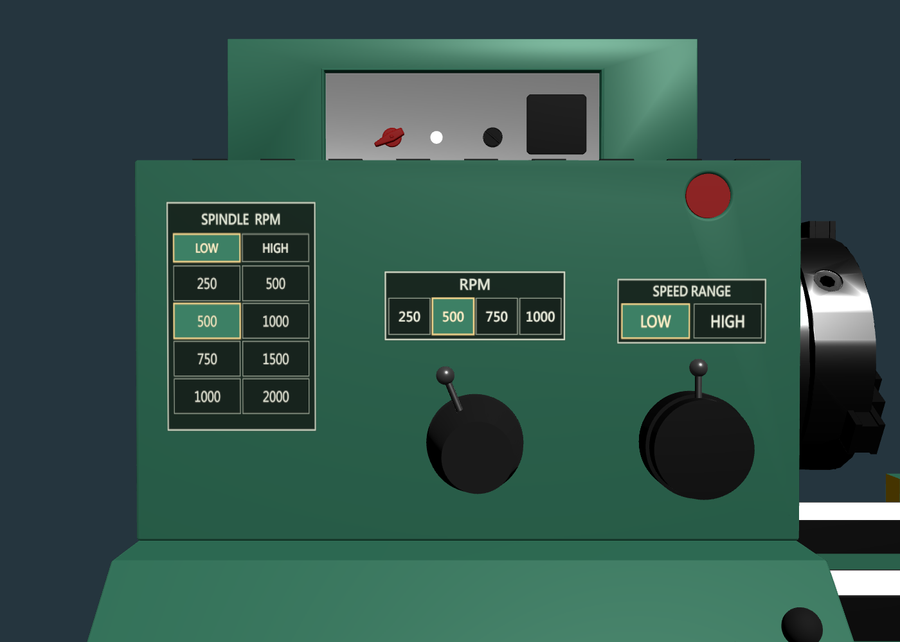
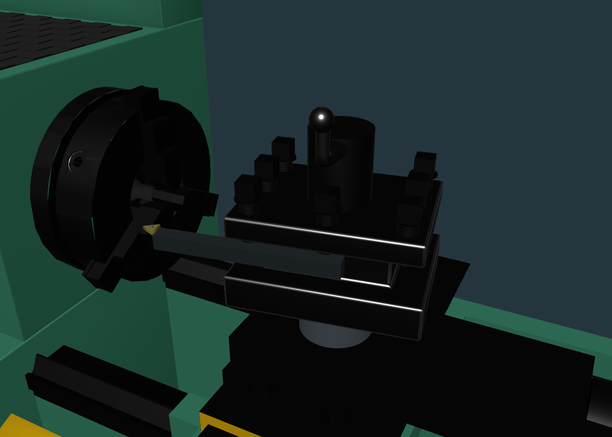
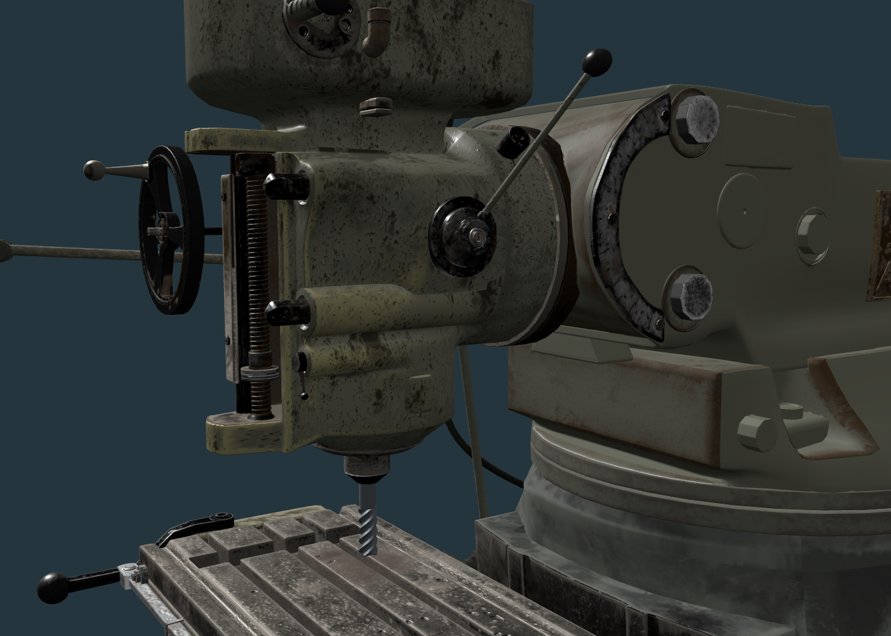
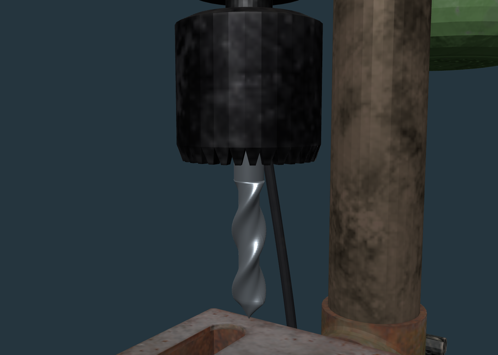

# 面板、完整刀座與三機刀具驗證

依使用者提供的「螢幕擷取畫面 2026-09-19 201939.png」修改。保留原 GLB，使用現有群組與少量新增刀具幾何。

## 車床
- 綠色機殼上使用窄 LOW/HIGH 表及 RPM、SPEED RANGE 小標籤，灰色面板隱藏。
- LOW 四檔 250/500/750/1000，HIGH 四檔 500/1000/1500/2000 RPM。
- 握把、金屬桿、旋轉座與透明 Hitbox 操作同一控制。
- ToolPostLowerBlock 納入完整升降與分度群組，左右每次 10°；車刀同步，Object_101/147 固定。
- 支撐柱下端固定、頂端延伸，升降全行程保持連接。

## 銑床
- Head_Part_009 長握桿啟停；Head_Part_023 保持隱藏，Head_Part_021 固定於機頭。
- MillingYControlsFixed 包含 Y 手輪、傳動盒、Z 操作手輪，位於 Z 升降群組之外，未使用反向位移。
- EndMill 掛在 Spindle_Rotor_Group，主軸箱保持固定。

## 鑽床
- TwistDrill 與 SpindleAssembly 對心，繼承旋轉、進給及回位；原 DrillBit 保留並隱藏。
- 其餘既有工作臺、進給手柄及開關結構保留。

## 驗證
- 模型稽核：三機零缺少參照。
- Unit tests：31/31 通過，涵蓋速度組合、Hitbox、完整刀座及支撐交疊、Z 階層隔離、刀具同軸、跟隨及 Reset。
- Production build：通過；保留既有大型 bundle 提醒。
- Browser tests：20/20 全部通過（包含實體點擊、雙向換檔、±10° 刀座分度、三機刀具連動與 Reset）。

近照由 scripts/capture-tooling.mjs 載入正式 runtime 產生。刀具尺寸為教學設定。
