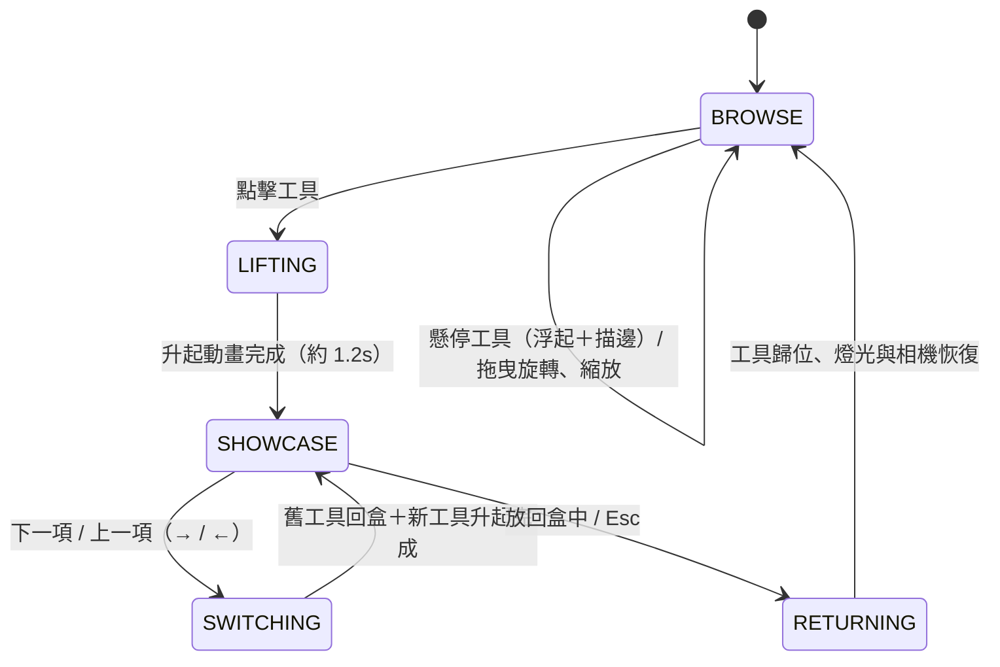

# 互動狀態圖

| 狀態 | 相機 | 燈光混合值 s | UI |
|---|---|---|---|
| BROWSE | OrbitControls（阻尼、限距、限俯角） | 0 | 無 |
| LIFTING | 緩動推近至展示視角 | 0 → 1 | 淡入 |
| SHOWCASE | 固定；拖曳改為旋轉工具 | 1 | 顯示 |
| SWITCHING | 固定 | 1 | 內容更新 |
| RETURNING | 緩動回到瀏覽視角 | 1 → 0 | 淡出 |

場景布局（單位 m）：工作台 3.6×2.2，頂面 y=0；工具盒 2.0×1.1×0.4 置中，盒蓋向後開約 105°；
磚牆 z=-1.6；愛迪生燈泡吊於 (0.55, 2.3, -0.35)；展示點 D=(-0.05, 1.1, 1.3)（工作台前緣上方，光錐不照到工具盒），聚光燈在 D 正上方。
